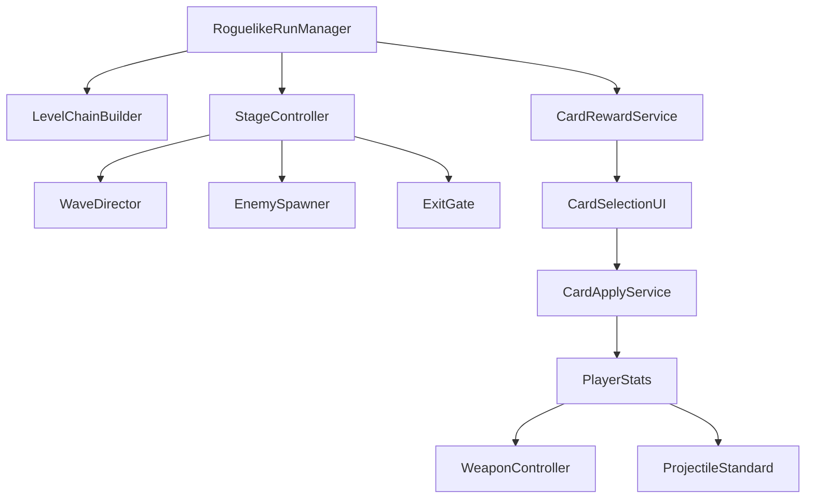
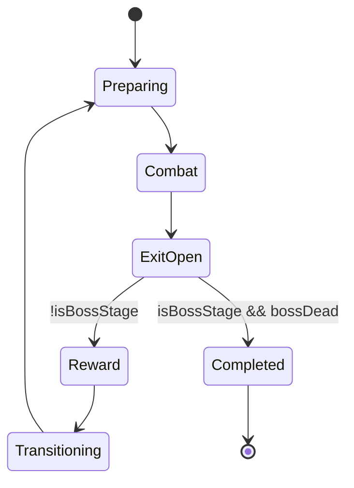
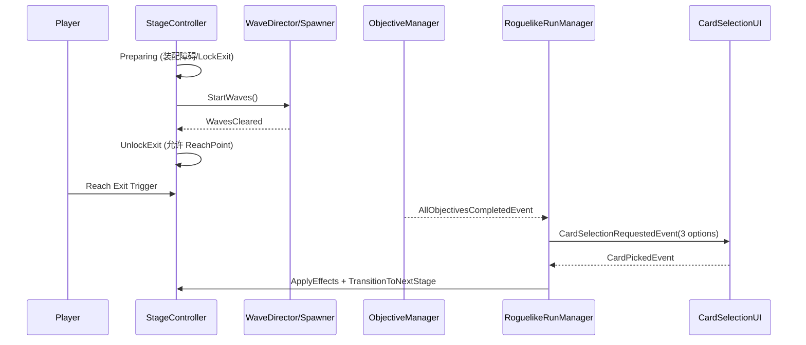

# FPS Roguelike（肉鸽）系统落地设计文档

> 目标：在现有 FPS 项目框架上，新增“每次开局随机拼接线性关卡 + 敌人波次随难度/通关数增长 + 通关三选一卡 + 属性/武器词条成长 + 最后一关固定 Boss”的完整肉鸽循环。  
> 原则：正确性 > 可维护性 > 性能；但热路径（Update/高频回调）**零 GC**、零 LINQ、零隐式装箱。

---

## 0. 一周 Demo 裁剪版（可玩闭环优先）

> 目标：**7 天内做出可玩的肉鸽 Demo**。本章节覆盖的内容为“必须做”；其余章节视为“后续增强”，可暂不实现。

### 0.1 必做（Keep）

- **Run 闭环**：开始一局 → 连续通过若干关卡段 → 最后一关 Boss → 结算胜负（胜利/失败 UI 或切换场景）。
- **关卡生成方式（简化但“真实拼接”）**：**单 Scene + 真实几何拼接 3~5 个关卡段（Segment）**。  
  - 进入场景后随机生成 3~5 个关卡段（最后一段可固定 Boss），使用 `Entrance/Exit` Connector 对齐，把几何真正“接起来”，形成一条线性路径。
  - **段与段之间用“门（Door/Gate）”链接**：门默认关闭；通关当前段后门打开；玩家进入下一段后门立刻关闭（形成“房间推进”）。
  - 说明：这比 Teleport 更符合直觉，也更利于关卡沉浸；Demo 阶段优先保证拼接稳定（避免重叠/穿模/堵门）。
- **刷怪（简化）**：每段 1~3 波（甚至 1 波）即可，清完开门（即“解锁前进门”）。  
  - 先用 **“刷怪总量预算 + 随机敌人组合”**，不做复杂模板系统。
- **三选一卡**：每段通关弹 3 张卡，选 1 张立即生效。
- **卡牌效果（最小集合）**：只做“能明显改变手感”的 3~6 种：
  - 攻击倍率（全武器生效）
  - 额外弹道（全武器生效）
  - 换弹/冷却相关（可选，若你武器类型需要）
  - 获得新武器（从武器池随机给一把）
  - （可选）暴击：在**开火时**对每颗子弹 roll，直接写入 projectile 的伤害（避免引入完整伤害管线）
- **难度增长（简化）**：只按“已通关段数”增长：
  - 增加每段刷怪预算或敌人数；先不做敌人属性倍率（平衡更麻烦）。

### 0.2 暂不做（Cut）

- 存档/读档、中途继续、局外成长（Meta）
- Seed 可复现随机（先用 `UnityEngine.Random`，Demo 可接受）
- 运行时 NavMeshSurface 重建（如果你的敌人导航因此不可用，则退回“段内 NavMesh 已可走通 + 门口用简单通道”的关卡制作约束；或只在生成完成后 Build 一次）
- 子弹反弹（需要改 `ProjectileStandard` 碰撞与忽略逻辑，容易牵出边界问题，一周内先砍）
- “伤害管线/DamageContext” 完整体系（后续再上）

### 0.3 七天实现顺序（建议）

- **Day 1**：`RoguelikeRunManager` + `RunState`（无存档）+ 段序列抽取（随机 3~5 段，最后 Boss 可固定）+ `LevelChainBuilder` 真实拼接（对齐 Entrance/Exit）+ 生成“门”占位并默认关闭  
- **Day 2**：`StageController`（Preparing/Combat/ExitOpen/Reward/Transitioning）+ `DoorGate`（门）开关与“进入后关门”触发器 + 段完成判定（复用 Objective 或波次清完事件）
- **Day 3**：`EnemySpawner` + 极简 `WaveDirector`（每段 1~3 波）+ 清怪后“开门前进”（并锁住后退门）
- **Day 4**：卡牌系统骨架：`CardDefinitionSO`/`CardPoolSO` + 抽 3 选 1 + UI（能点选）
- **Day 5**：最小 `PlayerStats`（AttackMultiplier、AdditionalProjectiles）并接入 `WeaponController`/projectile 伤害
- **Day 6**：加入“获得新武器”卡（对接 `PlayerWeaponsManager.AddWeapon`）+ Boss 段流程（Boss 死=胜利）
- **Day 7**：调参、修 bug、加 2~4 张卡、加 2~3 个段 prefab、确保完整可玩闭环

### 0.4 Gamefeel + Juicy（Demo 必做清单）

> 参考：《Juice it or lose it》（夸张反馈、缓动、形变、粒子、音效）与《The Art of Screenshake》（屏幕震动、顿帧、数值爽感、永久性）。  
> 目标：让玩家在“开枪→命中→击杀→清房→门开→进门→门关→开战→抽卡”这条链路上，**每一步都有明确且爽的反馈**。

#### 0.4.1 基本原则（写进实现规范）

- **每个关键事件至少 2 层反馈**：视觉 + 听觉（或 镜头/时间）。只给粒子不够，只给音效也不够。
- **短促、可控**：屏幕震动/顿帧必须“短促且强弱分级”，否则会眩晕/烦躁。
- **可读性优先于华丽**：玩家要一眼看懂“命中了/击杀了/清房了/门开了/进入下一房间了”。
- **低频触发，热路径零 GC**：命中/开火是高频点，避免 LINQ、避免每次 new 列表、避免字符串拼接；尽量缓存引用/对象池（Demo 允许先不池化，但不要在热路径做复杂逻辑）。

#### 0.4.2 本项目的“挂点”（从哪里触发 Juicy）

- **开火**：`WeaponController.HandleShoot()` 最末尾有 `OnShoot?.Invoke()` 与 `OnShootProcessed?.Invoke()`  
  - 用途：枪口闪光增强、FOV kick、轻微屏幕震动、开火音效分层
- **命中**：`ProjectileStandard.OnHit(...)`  
  - 用途：命中特效/音效、命中提示（hit marker）、命中轻微顿帧（可选）
- **击杀**：`EnemyController.OnDie()`  
  - 用途：击杀确认音、击杀大特效、击杀顿帧、尸体/碎片“永久性”留存一会儿
- **清房**：`ObjectiveManager` 广播 `AllObjectivesCompletedEvent`（或你后续的 StageCompleted）  
  - 用途：CLEAR 字样、门解锁音、灯光变色、奖励 UI 弹出
- **门**：`DoorGate` / 进入下一段触发器（你将新增）  
  - 用途：门开“咔哒”、门关“砰”、小震动、战斗开始 stinger
- **抽卡**：卡牌 UI 打开/选择  
  - 用途：卡牌依次弹出、稀有度强调、选择“盖章感”

#### 0.4.3 事件 → 反馈映射表（建议强弱分级）

| 事件 | 视觉反馈 | 听觉反馈 | 镜头/时间反馈 | 备注 |
|---|---|---|---|---|
| 开火（每发） | 更亮/更大的 muzzle flash；轻微武器后坐缓动（overshoot） | 枪声分 2 层（爆裂+机械），可加低频 | 轻微屏幕震动（很小）/FOV kick（+2~5） | 高频：必须轻量 |
| 命中敌人 | Hit VFX（血雾/火花）；敌人受击闪（你已有） | “啪”的命中确认音 | 小顿帧 0.02s（可选）；小震动 | 优先做“命中确认” |
| 击杀 | 更大的 death VFX；（可选）ragdoll/碎块留存 | 更重的击杀音（低频） | 顿帧 0.04s；中等震动 | “爽点”必须明显 |
| 清房（波次完成） | CLEAR UI；门锁粒子/灯变绿 | 解锁音（咔哒）+ 上扬提示音 | 很小震动（可选） | 这是房间推进节拍器 |
| 进门关门（进入下一段） | 门快速关合+火花（可选）；下个房间灯光/警报 | 金属重击（砰）+ 战斗开始 stinger | 中等震动 0.08s | “进入战斗”仪式感 |
| 抽卡弹出 | 3 张卡依次弹出（带微随机延迟）；稀有卡更亮 | 抽卡音；稀有卡音更清亮 | 轻微慢放/镜头聚焦（可选） | 肉鸽第二爽点 |
| 选卡确认 | 选中卡放大+盖章；另外两张碎裂/淡出 | 确认音（咚） | 可小震动 | 让选择有重量 |

#### 0.4.4 推荐参数（可直接拿来调）

> 这些是“先好用、后微调”的默认值区间。

- **屏幕震动（时长都要短）**
  - 开火：强度 0.05~0.10，时长 0.05s
  - 命中：强度 0.10~0.20，时长 0.06s
  - 击杀：强度 0.20~0.40，时长 0.08s
  - 门关：强度 0.15~0.30，时长 0.08s
- **顿帧（Hit Stop）**
  - 命中：0.02s
  - 击杀：0.04s
  - Boss 关键阶段：0.06~0.10s（谨慎）
- **FOV kick**
  - 每发 +2~5，回弹 0.08~0.15s（ease out + overshoot）
- **卡牌 UI**
  - 依次弹出间隔：0.08~0.15s（加 0~0.05 随机抖动更“活”）

#### 0.4.5 “数值爽感”的最低要求（来自 Nijman）

- **敌人不要太肉**：前 1~2 房间要让玩家频繁击杀，尽快建立“我很强”的反馈闭环。
- **射速与子弹可读性**：子弹速度更快、tracer 更明显；不要做写实小子弹。
- **更多更快的敌人**：玩家拿到卡变强后，用数量/节奏施压，而不是单纯加血。

#### 0.4.6 永久性（Permanence，便宜但高级）

- 弹壳、短时间尸体/碎片、墙面命中火花残留（任选其一）  
  让玩家感觉“这里确实发生过战斗”，房间推进才有旅程感。

### 0.5 简易池化（性能增强，建议至少做弹丸/VFX）

> 目的：降低 `Instantiate/Destroy` 的 CPU 与 GC 压力，尤其在“射速高/多弹道/大量命中特效”的肉鸽 build 下。

#### 0.5.1 实现优先级（只做最值的）

- **P0：弹丸池（Projectile Pool）**  
  - 当前 `WeaponController` 每次开火都会 `Instantiate(ProjectilePrefab)`；多弹道卡会把这个频率成倍放大。
- **P1：命中 VFX 池（Impact VFX Pool）**  
  - 当前 `ProjectileStandard.OnHit()` 会 `Instantiate(ImpactVfx)` 并延迟 `Destroy`，同样高频。
- **P2：敌人池（Enemy Pool）**（可选）  
  - 刷怪密集时收益高，但敌人状态复杂（AI/NavMesh/动画/血量/掉落/事件订阅），Demo 可先不做或做轻量版。

#### 0.5.2 最小接口（避免回收后状态脏）

建议所有可池化对象实现统一重置接口：

- `IPoolable`
  - `void OnSpawned()`：重置运行态（计时器、粒子、Trail、速度等）
  - `void OnDespawned()`：停止协程、关粒子、清引用（Owner 等）

#### 0.5.3 回收时机（对接当前代码）

- **弹丸（ProjectileStandard/ProjectileBase）**
  - 现状：命中 `Destroy(gameObject)`；启用时 `Destroy(gameObject, MaxLifeTime)`
  - 池化：改为
    - 命中：`ReturnToPool()`（替代 Destroy）
    - 超时：由弹丸计时或池统一计时后 `ReturnToPool()`
- **Impact VFX**
  - 现状：命中 `Instantiate(ImpactVfx)`，并在 `ImpactVfxLifetime` 后 `Destroy`
  - 池化：播放/计时结束后回池（不要每次 new 粒子对象）
- **敌人（如果做）**
  - 现状：`EnemyController.OnDie()` 最后 `Destroy(gameObject, DeathDuration)`
  - 池化：死亡动画/延迟结束后回池，并确保：
    - `Health` 重置、`NavMeshAgent` 状态重置、AI 状态清理
    - 所有事件订阅遵守生命周期对称（OnEnable/OnDisable 或 Start/OnDestroy）

#### 0.5.4 Demo 约束（别把池做复杂）

- **固定容量**：`prewarmCount` + `maxCount`，超出上限可退回 `Instantiate`（简单可靠）。
- 回收用 `SetActive(false)`，并挂回池父节点，保持层级干净。
- **避免字符串 key**：用 prefab 引用缓存池，或 `Dictionary<int, Pool>`（key 用 `GetInstanceID()`）。

---

## 1. 现状审计（基于当前代码）

### 1.1 已有系统（可复用）

- **事件系统**：`Unity.FPS.Game.EventManager`，以 `GameEvent` 为基类的轻量广播系统，支持 `AddListener<T>/RemoveListener<T>/Broadcast(GameEvent)`。
- **目标系统（胜利条件）**：`Objective` / `ObjectiveManager`
  - `ObjectiveManager` 在 `Update()` 中轮询所有阻塞目标（`Objective.IsBlocking()`），全部完成后广播 `AllObjectivesCompletedEvent`。
  - 已有目标类型：
    - `ObjectiveKillEnemies`：监听 `EnemyKillEvent` 完成清怪任务。
    - `ObjectiveReachPoint`：触发器碰到玩家即完成。
- **敌人管理**：`AI/EnemyManager`
  - 敌人 `EnemyController.Start()` 时 `RegisterEnemy(this)`，死亡时 `UnregisterEnemy(this)` 并广播 `EnemyKillEvent`。
  - 因此**只要刷怪 Instantiate 敌人预制体**，击杀计数/目标更新链路将自动工作。
- **武器/弹丸框架**：
  - `WeaponController` 决定发射行为、`BulletsPerShot` 控制每次发射子弹数，射击时 `Instantiate(ProjectilePrefab)`。
  - `ProjectileStandard` 命中后直接伤害并 `Destroy(this.gameObject)`。
  - `PlayerWeaponsManager` 提供 `AddWeapon(weaponPrefab)`，可在运行时新增武器并加入武器槽。

### 1.2 现有系统的“肉鸽冲突点”

- 目前 `GameFlowManager` 将 `AllObjectivesCompletedEvent` 解释为“赢游戏并切 WinScene”。  
  **肉鸽需要把它改造成“本关/本段完成”**，只有最终 Boss 段完成才是“赢一局”。
- 当前没有：
  - 关卡段（prefab）拼接系统
  - 波次生成/刷怪导演系统
  - 卡牌系统与属性/词条聚合系统
  - 暴击、反弹等弹丸机制

---

## 2. 肉鸽玩法定义（需求澄清后的规格）

### 2.1 关卡结构

- **线性关卡链**：一个 Run 由若干“关卡段（Segment）预制体”首尾相连组成。
- **每段都有入口/出口**：使用标准化 Connector 对齐拼接（Entrance → Exit）。
- **最后一段固定 Boss**：Boss 段 prefab 固定；其余段从池中随机抽取。
- **每段内部随机化**：
  - 障碍物：从障碍物池按难度/权重随机装配到“障碍槽位”
  - 敌人波次：随难度与已通关段数增长，波次结构/数量/敌人组合变化

### 2.2 通关奖励

- 每段通关弹出 **3 张卡牌**，玩家三选一。
- 卡牌效果随机但可控（稀有度/权重/去重/流派偏向）。
- 属性包含（可扩展）：
  - 攻击力（乘算/加算）
  - 暴击率、暴击伤害
  - 弹道数量（多弹/散射）
  - 子弹反弹次数
  - 获得新武器（加入武器池并自动拾取/或进入背包）

---

## 3. 总体架构与模块边界（新增系统清单）

> 目标：避免“万能 Manager”，每个系统有清晰所有权与生命周期对称；数据用 ScriptableObject，运行态用独立实例；展示层仅订阅，不反向驱动规则。

### 3.1 模块列表（建议命名空间/目录）

建议新增目录：

- `Assets/FPS/Scripts/Roguelike/`
  - `Run/`：一次开局的状态机与存档
  - `Level/`：关卡段拼接、段元数据、出口控制
  - `Waves/`：刷怪导演、刷怪器、敌人配置
  - `Cards/`：卡牌抽取、奖励流程、效果应用
  - `Stats/`：属性系统、modifier 叠加、战斗数值入口
  - `UI/`：卡牌选择 UI、Run HUD、调试面板（可选）

（可选）使用 `asmdef`：`Unity.FPS.Roguelike`，避免与 `Unity.FPS.Game/Gameplay/AI/UI` 乱依赖。

### 3.2 核心运行时对象

#### 3.2.1 `RoguelikeRunManager`（Run 运行器，唯一真相）

- **职责**：
  - 管理一次 Run 的生命周期：StartRun → StageLoop（多段）→ Boss → EndRun
  - 保存 RunState：seed、当前段索引、难度、通关数、已选卡牌、玩家属性快照
  - 驱动：生成关卡链、开始/结束波次、弹出卡牌奖励、跳转到下一段
- **禁止**：把刷怪细节、UI 动画等塞进 RunManager；只做编排（Orchestration）。

#### 3.2.2 `RunState`（纯数据，非 MonoBehaviour）

包含：

- `int runSeed`
- `int stageIndex`（当前第几段，从 0 开始）
- `int clearedStages`（已通关段数）
- `float difficulty`（运行中可动态变化）
- `List<CardId> pickedCards`
- `PlayerStatSnapshot stats`（聚合后的数值，或者 modifier 列表）
- `List<WeaponId> unlockedWeapons`（可选）

### 3.3 数据驱动（ScriptableObject 资产）

> 规则：SO 只存“配置/定义”，运行时不要修改 SO 资源本体。

#### 3.3.1 `RoguelikeRunConfigSO`

- 段数量、Boss 段引用、段池引用
- 难度增长曲线参数
- 卡牌抽取规则（稀有度权重、去重、保底）
- 刷怪预算曲线（每段刷怪总量/精英率/波次数）

#### 3.3.2 关卡段相关

- `LevelSegmentDefinitionSO`（一类段的元数据）
  - prefab 引用
  - 段标签：主题、难度等级、长度、可用敌人池
  - 可用障碍物池引用
- `LevelSegmentPoolSO`
  - 多个 `LevelSegmentDefinitionSO` + 权重
  - 可按难度分层（Tier1/Tier2/Tier3）

#### 3.3.3 波次相关

两种可选方案：

- **方案 A：纯生成（推荐前期）**  
  `WaveDirector` 根据难度用公式生成波次，不需要大量 SO。
- **方案 B：模板 + 生成（推荐中后期）**  
  `WavePresetSO` 定义波次模板，运行时在模板基础上按难度增减。

最小字段建议（Preset）：

- `int baseWaveCount`
- `EnemyArchetypeSO[] enemyPool`
- `AnimationCurve budgetByDifficulty`
- `float eliteChance`
- `float spawnInterval`

#### 3.3.4 卡牌相关

- `CardDefinitionSO`
  - `string id`
  - `string displayName`
  - `CardRarity rarity`
  - `string descriptionTemplate`（可插值显示数值）
  - `CardEffectSO[] effects`
- `CardPoolSO`
  - 卡列表 + 权重 + 黑名单规则

#### 3.3.5 属性/效果相关

推荐“效果→modifier→属性聚合”的结构：

- `StatId`（枚举或字符串常量）：`AttackMult/CritChance/CritDamage/AdditionalProjectiles/ProjectileBounces/...`
- `Modifier`（运行态结构体/类）
  - `StatId stat`
  - `ModifierOp op`（Add/Mul/Override）
  - `float value`
  - `string sourceId`（卡牌 id，用于 UI 展示与去重）

---

## 4. 关卡段（Segment）Prefab 约定（必须标准化）

### 4.1 必备组件

每个“关卡段 prefab”根节点必须包含：

- `LevelSegment`（新脚本）
  - `SegmentConnector entrance`
  - `SegmentConnector exit`
  - `Bounds segmentBounds`（用于避免重叠、调试用）
  - `Transform playerSpawnPoint`（可选，默认用 entrance）
  - `ExitGate exitGate`（出口锁/门/传送触发器）
  - `EnemySpawnPointGroup spawnPoints`（刷怪点集合）
  - `ObstacleSlotGroup obstacleSlots`（障碍槽位集合）
  - `Objective[] objectivesInThisSegment`（可选，或运行时扫描子物体）

### 4.2 Connector 约定（Entrance/Exit 对齐规则）

`SegmentConnector` 仅是一个 Transform + 朝向约定：

- connector 的 `forward` 指向“段内前进方向”
- 拼接时：让 **上一段 Exit 的位置/旋转** 对齐 **下一段 Entrance**（可能需要额外的 offset）

计算示意：

- 目标：`nextSegment.Entrance` 变换后与 `prevSegment.Exit` 重合
- 做法：
  - 先旋转：`deltaRot = prevExit.rotation * Quaternion.Inverse(nextEntrance.rotation)`
  - 再平移：`deltaPos = prevExit.position - (deltaRot * nextEntrance.position)`

> 注意：这是典型“对齐某个子点”的拼装逻辑，建议放在 `LevelChainBuilder`，并提供 Gizmos 调试。

### 4.3 NavMesh 注意事项（AI 使用 NavMeshAgent）

你当前敌人使用 `NavMeshAgent`。段拼接会带来 NavMesh 问题，建议提前选策略：

#### 策略 1（推荐 MVP）：单场景、预铺大 NavMesh

- 把所有段都放在同一张大地形/走廊里，段仅负责障碍/刷怪/门禁，不做真正几何拼接。
- 优点：不需要运行时重建 NavMesh。
- 缺点：随机性主要来自“内容装配”，不是几何拓扑。

#### 策略 2：段拼接 + 运行时 NavMeshSurface 重建

- 每段带 `NavMeshSurface`，拼完后统一 `BuildNavMesh()`
- 优点：几何完全随机。
- 缺点：运行时 Bake 可能卡顿；需要分帧/加载屏；移动平台慎用。

#### 策略 3：段拼接 + 预烘焙 + OffMeshLink（中后期）

- 每段内部 NavMesh 预烘焙，段之间用 `OffMeshLink` 在出口/入口连接。
- 优点：运行时无 Bake。
- 缺点：需要严格对齐与链接管理。

---

## 5. 敌人波次系统设计

### 5.1 关键目标

- 波次随难度增长（更密、更强、更多组合）
- 可控的节奏（刷怪间隔、波次间歇、精英插入）
- 出口门禁：未完成波次/目标则出口不可用
- 性能：刷怪尽量对象池；至少提供“同屏上限/总上限”

### 5.2 核心类

#### 5.2.1 `WaveDirector`（规则层）

- 输入：`RunState`（difficulty、clearedStages 等）、`LevelSegmentDefinition`（段标签）、`WavePreset`（可选）
- 输出：`WavePlan`（波次计划）

`WavePlan` 建议字段：

- `List<Wave> waves`
- `int totalEnemiesPlanned`
- `float plannedDuration`（用于节奏估计，可选）

`Wave` 字段：

- `List<SpawnInstruction> spawns`
- `float waveStartDelay`
- `WaveClearRule clearRule`（KillAll / KillCount / Timer / EliteKill 等）

`SpawnInstruction`：

- `EnemyArchetypeSO archetype`
- `int count`
- `float spawnInterval`
- `SpawnPointPolicy policy`（Random/NearestToPlayer/Farthest/Weighted）

#### 5.2.2 `EnemySpawner`（执行层）

- 负责把 `SpawnInstruction` 变成实际的敌人实例：
  - 选择 spawn point
  - Instantiate 或从对象池取
  - （可选）给敌人挂“难度缩放组件”（例如加血/加伤/精英材质）
- 不需要处理击杀计数：`EnemyController` 已自动接入 `EnemyManager`/`EnemyKillEvent`。

### 5.3 难度缩放（建议公式）

先用简单、可调的线性公式：

- `difficulty = base + stageIndex * stageSlope + clearedStages * clearSlope`

将 difficulty 映射到可控维度：

- `enemyBudget = budgetCurve.Evaluate(difficultyNormalized)`
- `waveCount = baseWaveCount + floor(difficulty * waveSlope)`
- `eliteChance = min(maxElite, baseElite + difficulty * eliteSlope)`

缩放对象（从轻到重）：

- 先：数量/组合/波次（体验变化大，数值风险小）
- 再：敌人血量/伤害倍率（数值风险更大，需要更细调）

---

## 6. 关卡完成与流程编排（替代“直接赢游戏”的胜利链路）

### 6.1 现有链路的问题

当前：`AllObjectivesCompletedEvent` → `GameFlowManager.EndGame(true)` → 切 `WinScene`。  
肉鸽需要：普通段完成 → 发奖励 → 下一段；Boss 段完成 → 才 EndGame(true)。

### 6.2 建议新增事件（避免语义混淆）

新增 Roguelike 专用事件（放在 `Roguelike/Run/RoguelikeEvents.cs`）：

- `StageCompletedEvent`：普通段完成
  - `int stageIndex`
  - `bool isBossStage`
- `CardSelectionRequestedEvent`：需要弹出三选一
  - `CardDefinitionSO[] options`
- `CardPickedEvent`
  - `string cardId`
- `RunCompletedEvent`
  - `bool win`

> 说明：你也可以继续用 `AllObjectivesCompletedEvent` 作为“段完成”，但必须让 `GameFlowManager` 不再直接监听它；否则会在第一段就赢。

### 6.3 段完成的触发来源（两种做法）

#### 做法 A（复用 Objective，推荐）

- 每段 prefab 内放置 blocking objectives：
  - 清波次：`ObjectiveKillEnemies`
  - 到出口：`ObjectiveReachPoint`（出口触发器）
- 让 `ObjectiveManager` 仍然广播 `AllObjectivesCompletedEvent`，但由 `RoguelikeRunManager` 来解释：
  - 若当前段不是 Boss：触发抽卡 UI
  - 若是 Boss：触发 Run 胜利

#### 做法 B（不用 Objective，纯 Roguelike）

- `WaveDirector`/`ExitGate` 直接决定何时“段完成”
- 退出 Objective 系统

> MVP 阶段建议选 A：改动最少、复用 UI/HUD 目标提示能力。

---

## 7. 卡牌系统设计（三选一）

### 7.1 卡牌抽取（`CardRewardService`）

输入：

- `RunState`（难度、已选卡、流派倾向）
- `CardPoolSO`（可用卡池）
- `RoguelikeRunConfigSO`（抽取规则）

输出：

- `CardDefinitionSO[3]` options

抽取规则建议：

- **稀有度权重**：Common / Rare / Epic / Legendary
- **去重**：同一卡在本次 Run 不重复（或允许叠加但有上限）
- **保底**：比如 3 张中至少 1 张是“伤害向/武器向/生存向”之一
- **难度修正**：难度高时提升高稀有概率（但要谨慎，避免滚雪球过快）

### 7.2 卡牌效果表示（数据驱动）

每张卡由若干 `CardEffectSO` 组成，例如：

- `AddStatModifierEffectSO`：添加一个 modifier（AttackMult +10%）
- `GrantWeaponEffectSO`：解锁/获得新武器 prefab
- `AddProjectileBounceEffectSO`：反弹次数 +1
- `AddAdditionalProjectilesEffectSO`：弹道 +1

> 早期也可以不用 SO 多态，直接在 `CardDefinitionSO` 里存一组 `ModifierData`。但中后期扩展“召唤物/元素/状态异常”等会更痛。

### 7.3 UI 交互

- 弹出卡牌选择时：
  - 暂停玩家输入（或锁鼠标/禁用开火）
  - 显示 3 张卡：名称、稀有度、描述、预览数值变化（可选）
- 玩家选择后：
  - 立刻应用效果
  - 关闭 UI，继续下一段

生命周期对称：

- UI 订阅 `CardSelectionRequestedEvent`，关闭时解除订阅。

---

## 8. 属性/词条系统（战斗数值发动机）

### 8.1 为什么需要独立属性系统

如果把“攻击/暴击/反弹/弹道数”等直接改到散落脚本字段里，会出现：

- 数值来源不可追踪（到底是哪张卡加的？）
- 不好做展示（当前总暴击率是多少？）
- 不好做回放/存档（需要把一堆散字段序列化）
- 扩展成本高（后续新词条要改 N 个脚本）

因此建议做：

`CardPicked` → `Modifiers` → `StatAggregator` → `CombatPipeline`（在关键点读取）

### 8.2 `PlayerStats`（运行时组件）

建议挂在 Player 上：

- 持有 `List<Modifier>`（或更高效的数组结构）
- 提供 `GetFinal(StatId)` API
- 提供 `OnStatsChanged` 事件（低频：只在选卡/获得武器时触发）

性能建议：

- 选卡时重建缓存（把最终属性写入缓存字段），战斗时直接读缓存，不要每帧遍历 modifier 列表。

### 8.3 与现有战斗代码的对接点（实现落点）

#### 8.3.1 攻击力（对 Projectile 的 Damage）

可选落点：

- 落点 A（侵入最小）：**开火时**把伤害写入新生成的弹丸实例（对 `ProjectileStandard.Damage` 等字段赋值）。
- 落点 B（更统一）：**命中时**走“伤害计算管线”，根据伤害来源查询 `PlayerStats` 决定最终伤害。

建议 MVP 选 A，后续再演进到 B。

#### 8.3.2 弹道数量（多弹）

直接影响 `WeaponController.BulletsPerShot` 或在开火时使用 `bulletsPerShotFinal += AdditionalProjectiles`。

注意：

- 现有 `WeaponController.HandleShoot()` 在每次开火时计算 `bulletsPerShotFinal` 并 for 循环 Instantiate。
- 如果你希望“卡牌加弹道”对所有武器生效，应该由 `PlayerStats` 统一提供增量，而不是逐个修改武器 prefab 的 `BulletsPerShot` 配置。

#### 8.3.3 暴击（CritChance/CritDamage）

建议在“命中时”计算：

- roll：`Random.value < critChance`
- 伤害：`damage *= critDamageMult`（例如 2.0 表示双倍）

需要注意：

- 你当前 `Damageable` 里有 `DamageMultiplier`，但它更像“受击方倍率”，不是暴击系统。
- 暴击建议做在“伤害来源”侧，而不是“受击方”侧，避免敌我混淆。

#### 8.3.4 子弹反弹次数（ProjectileBounces）

需要改造 `ProjectileStandard.OnHit()`：

新增运行时字段：

- `int remainingBounces`

逻辑：

- 若 remainingBounces > 0 且命中 collider 不是 Damageable（或允许反弹地形/墙），则：
  - 计算反射方向：`reflect = Vector3.Reflect(velocity.normalized, hit.normal)`
  - 设置速度与朝向
  - remainingBounces--
  - 不销毁 projectile
- 否则执行原本 OnHit：伤害 + VFX + Destroy

> 注意：需要考虑“连续命中同一 collider”与“忽略列表”的扩展；并保证无 GC（不要在反弹时 new List）。

#### 8.3.5 获得新武器

对接点已存在：`PlayerWeaponsManager.AddWeapon(WeaponController weaponPrefab)`。

建议卡牌效果做：

- 从 `WeaponPoolSO` 抽一个武器 prefab（可按稀有度/当前持有去重）
- 调用 `AddWeapon`
- 可选：自动切换到新武器（调用 `SwitchToWeaponIndex`）

---

## 9. 关卡出口门禁与段间过渡

### 9.1 `ExitGate`

职责：

- 维护出口是否可用（locked/unlocked）
- 可视化：门动画/提示 UI/禁用触发器
- 条件：波次/目标完成后解锁

实现建议：

- 由 `RoguelikeRunManager` 或 `StageController` 统一调用：
  - `exitGate.Lock()`
  - `exitGate.Unlock()`

### 9.2 段间移动策略

两种方式：

- **传送（推荐）**：段完成后把玩家移动到下一段 Entrance（更省事）
- **物理连接**：段 Exit 直接连接到下一段 Entrance（更沉浸，但要处理 NavMesh/碰撞/光照等）

MVP 推荐“传送”：

- 出口触发器完成 `ObjectiveReachPoint`
- RunManager 收到段完成 → 抽卡 → 选卡后传送到下一段

---

## 10. 随机性与可复现（Seed 设计）

### 10.1 目标

- 同一 seed 下：
  - 抽段顺序一致
  - 障碍装配一致
  - 卡牌三选一致（在相同 pick 路径下）
  - 波次一致（或基本一致）

### 10.2 实现建议

避免使用全局 `UnityEngine.Random`（它是全局状态，易被别的系统打乱）。建议：

- `RunRng`：一个独立随机源，初始化为 `runSeed`
- 分子流（可选）：`levelRng = Hash(runSeed, stageIndex)`、`cardRng = Hash(runSeed, pickedCount)` 等

这样不会被粒子/AI 等系统“偷用随机”扰动。

---

## 11. 保存/读档与局外成长（可选但建议预留）

### 11.1 Run 存档（中途退出继续）

存：

- `RunState`（seed、stageIndex、clearedStages、difficulty、pickedCards、unlockedWeapons、玩家血量/弹药等）
- 当前关卡链的段序列（段 id 列表）与每段随机结果（障碍装配结果、波次 plan id）

### 11.2 Meta（局外解锁）

可单独一个 `MetaProgressionSave`：

- 已解锁卡牌/武器/段主题
- 永久升级（若你想加）

---

## 12. 性能与稳定性约束（必须遵守）

- **热路径禁止分配**：`Update/LateUpdate/FixedUpdate/OnGUI`、AI 高频回调、弹丸飞行/命中等。
- 波次生成、抽卡、关卡拼接：都属于低频，可允许少量分配，但建议在关卡加载/过渡阶段进行。
- **对象池优先**：
  - 敌人（至少中后期做池）
  - 弹丸（如果射速高且子弹多，建议池；否则 GC/Instantiate 会成为瓶颈）
- **生命周期对称**：所有 `AddListener/+=` 必须在 `OnDisable/OnDestroy` 对称解除。

---

## 13. 分阶段实现路线（建议里程碑）

### Milestone 0：不改战斗，只搭框架（1~2 天）

- 新建 `RoguelikeRunManager` + `RunState`
- 新建 `LevelSegment`、`SegmentConnector`、`LevelChainBuilder`（先随机摆放/传送）
- 把 `AllObjectivesCompletedEvent` 从“赢游戏”改成“段完成”的入口（或新增事件并改订阅者）

验收：

- 开局能随机选 3 个段 + 固定 Boss 段（Boss 段先当普通段）
- 走到出口能进入下一段

### Milestone 1：波次刷怪（2~4 天）

- 新建 `WaveDirector`（先公式生成 2~3 波）
- 新建 `EnemySpawner`（Instantiate）
- 出口门禁：波次未完成不可通关

验收：

- 每段能刷完波次后开门，`ObjectiveKillEnemies` 能正确完成

### Milestone 2：三选一卡（2~4 天）

- `CardDefinitionSO/CardPoolSO` 与抽取
- UI：三选一
- `PlayerStats` + modifier（至少支持：攻击倍率、弹道+1）

验收：

- 通关后弹出 3 张卡，选完立即生效（下段战斗可观察差异）

### Milestone 3：高级词条（3~7 天）

- 暴击（命中计算）
- 反弹（ProjectileStandard 改造）
- 新武器卡（对接 `PlayerWeaponsManager.AddWeapon`）
- 难度曲线与精英怪

验收：

- 多局体验差异明显，可形成 build

---

## 14. 需要改动/对接的现有文件清单（建议）

> 下面是“推荐改动点”，实现时可以更细化拆事件，避免大改。

- `Assets/FPS/Scripts/Game/Managers/GameFlowManager.cs`
  - 不要再把 `AllObjectivesCompletedEvent` 当作“赢游戏”
  - 改为只监听“RunCompletedEvent（win）”或“Boss 段完成事件”
- `Assets/FPS/Scripts/Game/Managers/ObjectiveManager.cs`
  - 可以保持不变（继续广播 `AllObjectivesCompletedEvent`）
  - 或增加“当前段上下文”，让它只管理当前段的 objectives（更干净）
- `Assets/FPS/Scripts/Game/Shared/WeaponController.cs`
  - 对接 `PlayerStats` 的弹道增量、伤害倍率（MVP 可只做弹道）
- `Assets/FPS/Scripts/Gameplay/ProjectileStandard.cs`
  - 添加反弹逻辑与（可选）暴击/伤害管线入口

---

## 15. 推荐的类关系图（概念）

---

## 16. 关键实现细节备忘（避免踩坑）

### 16.1 段内对象查找

避免 `FindObjectOfType` 在热路径频繁调用。建议：

- RunManager 生成段时拿到 `LevelSegment` 引用并缓存
- StageController 在段激活时一次性收集：spawnPoints、exitGate、objectives

### 16.2 “目标系统”与“波次系统”的职责分离

推荐：

- 波次系统负责：刷怪与波次结束判定
- 目标系统负责：UI 展示与“段完成”的统一判定入口

例如：

- 波次结束后调用 `ExitGate.Unlock()` 并/或触发 `ObjectiveReachPoint` 可达

### 16.3 暂停输入

抽卡 UI 时要阻止开火/移动：

- 可在 `PlayerInputHandler.CanProcessInput()` 增加一个“外部锁”（RunManager 设置）
- 或在抽卡时把 `Cursor.lockState` 改为 None，结束后恢复

注意要与 `GameFlowManager` 的“结束游戏解锁鼠标”逻辑不冲突。

---

## 17. 附录：建议的文件命名（实现时按此生成）

- `RoguelikeRunManager.cs`
- `RunState.cs`
- `RoguelikeRunConfigSO.cs`
- `LevelSegment.cs`
- `SegmentConnector.cs`
- `LevelSegmentDefinitionSO.cs`
- `LevelSegmentPoolSO.cs`
- `LevelChainBuilder.cs`
- `StageController.cs`
- `ExitGate.cs`
- `EnemySpawner.cs`
- `WaveDirector.cs`
- `WavePlan.cs`
- `CardDefinitionSO.cs`
- `CardPoolSO.cs`
- `CardRewardService.cs`
- `CardApplyService.cs`
- `PlayerStats.cs`
- `Modifier.cs`
- `StatId.cs`
- `RoguelikeEvents.cs`

---

## 18. 下一步落地建议（你实现时的“第一件事”）

先做一个“无 NavMesh 拼接风险”的 MVP：

- 使用 **传送式段切换**（不做几何拼接），先把“段 prefab 顺序随机 + 通关进入下一段 + Boss 段固定”跑通
- 再逐步加：波次 → 三选一卡 → 属性生效 → 反弹/暴击/新武器

当 MVP 流程闭环后，再评估是否要升级到“真正几何拼接 + NavMesh 策略 2/3”。

---

## 19. 详细数据结构（字段表，照着建 SO/脚本就能开工）

> 下面用“字段表”的形式把每个关键 ScriptableObject/运行态对象写清楚，避免实现时反复改结构。

### 19.1 `RoguelikeRunConfigSO`（全局配置）

**用途**：集中配置“本次肉鸽模式”的玩法参数，供 `RoguelikeRunManager` / `WaveDirector` / `CardRewardService` 读取。

建议字段：

- **关卡链**
  - `int normalStageCount`：普通段数量（不含 Boss）
  - `LevelSegmentPoolSO normalSegmentPool`
  - `LevelSegmentDefinitionSO bossSegment`
  - `bool allowRepeatSegments`：普通段是否允许重复
  - `int maxRepeatPerSegmentId`：若允许重复，重复上限（防止一直抽同一段）
- **难度曲线**
  - `float baseDifficulty`
  - `float difficultyPerStage`：每通过一段增加
  - `float difficultyPerClear`：通关数/轮回数增加（你提到“通关数增加”）
  - `AnimationCurve difficultyToBudgetCurve`：把 difficulty 映射到“刷怪预算/强度”的曲线
- **波次**
  - `int minWavesPerStage`
  - `int maxWavesPerStage`
  - `float spawnIntervalMin`
  - `float spawnIntervalMax`
  - `int maxAliveEnemies`：同屏上限（强烈建议有，避免失控与卡顿）
  - `float eliteChanceBase`
  - `float eliteChancePerDifficulty`
- **卡牌奖励**
  - `CardPoolSO cardPool`
  - `int rewardOptions = 3`
  - `bool preventDuplicateCardsInRun`
  - `int maxStacksPerCard`（若允许叠加）
  - `CardRarityWeights rarityWeights`
  - `float rarityBoostPerDifficulty`（可选）
- **武器奖励**
  - `WeaponPoolSO weaponPool`（新建，见 19.6）
  - `bool autoSwitchToGrantedWeapon`

### 19.2 `RunState`（运行态数据，必须可序列化/可存档）

建议字段：

- `int runSeed`
- `int stageIndex`
- `int clearedStages`
- `float difficulty`
- `List<string> segmentIdChain`：本次 Run 的段序列（普通段 + Boss 段）
- `List<string> pickedCardIds`
- `List<ModifierData> modifiers`：比“只存最终数值”更稳（便于展示/回放/重算）
- `List<string> unlockedWeaponIds`

（可选）玩家状态快照（如果你要中途继续）：

- `float playerHealthRatio`
- `string activeWeaponId`
- `Dictionary<string, int> ammoByWeaponId`（或只存当前武器弹量）

### 19.3 关卡段：`LevelSegmentDefinitionSO` / `LevelSegmentPoolSO`

#### 19.3.1 `LevelSegmentDefinitionSO`

建议字段：

- `string id`
- `GameObject prefab`
- `int tier`：段难度等级（1/2/3）
- `string[] tags`：主题标签（Industrial/Cave/Outdoor…）
- `float weight`：抽取权重
- `EnemyArchetypePoolSO enemyPoolOverride`（可选：某些段有特殊敌人）
- `ObstacleSetSO obstacleSet`（本段可用障碍集合）
- `bool isBossSegment`

#### 19.3.2 `LevelSegmentPoolSO`

建议字段：

- `List<LevelSegmentDefinitionSO> segments`
- `bool useTierFiltering`
- `AnimationCurve difficultyToTier`（或改成阈值表：difficulty>=x 用 Tier2…）

### 19.4 障碍物随机装配：`ObstacleSetSO` / `ObstacleSlot`

#### 19.4.1 `ObstacleSetSO`

建议字段：

- `List<ObstacleEntry> obstacles`

`ObstacleEntry`：

- `string id`
- `GameObject prefab`
- `float weight`
- `int minStageIndex` / `int maxStageIndex`（出现范围）
- `string[] requiredTags` / `string[] forbiddenTags`

#### 19.4.2 `ObstacleSlot`（挂在段 prefab 内的槽位点）

建议字段：

- `string slotId`：稳定 id（用于可复现随机）
- `Transform anchor`
- `Vector3 localOffset`
- `Vector3 localEuler`
- `string[] slotTags`（例如：Cover/Trap/Blocking/Decor）
- `bool allowEmpty`
- `bool affectsNavigation`：若会挡路，必须同步 NavMesh/或用 `NavMeshObstacle`
- `float clearRadius`：避免生成后与墙/门/出口重叠（生成时做一次 `Physics.CheckSphere`）

**生成规则（强约束）**：

- 生成必须在“段激活/开始”一次性完成，禁止每帧随机。
- 使用 RunSeed 的派生随机流：`slotRng = Hash(runSeed, stageIndex, slotIdHash)`，确保可复现。
- 若生成失败（重叠/挡门），允许重试固定次数；超过次数则 `allowEmpty` 时置空，否则降级为“装饰型障碍”。

### 19.5 波次与敌人：`EnemyArchetypeSO` / `EnemyArchetypePoolSO`

#### 19.5.1 `EnemyArchetypeSO`

用途：把“敌人预制体 + 权重 + 难度缩放参数”统一配置，避免在代码里硬编码。

建议字段：

- `string id`
- `GameObject prefab`
- `float weight`
- `int minStageIndex` / `int maxStageIndex`
- `float budgetCost`：用于预算刷怪（cost 越高越少刷）
- `EnemyScaling scaling`

`EnemyScaling` 建议字段：

- `float healthMulBase`
- `float healthMulPerDifficulty`
- `float damageMulBase`
- `float damageMulPerDifficulty`
- `float moveSpeedMulBase`（可选）

精英（可选）：

- `bool canBeElite`
- `float eliteBudgetExtraCost`
- `Material eliteMaterial` / `GameObject eliteVfx`

#### 19.5.2 `EnemyArchetypePoolSO`

- `List<EnemyArchetypeSO> enemies`
- `bool preventRepeatsInWave`（可选）

### 19.6 卡牌：`CardDefinitionSO` / `CardPoolSO` / Effects

#### 19.6.1 `CardDefinitionSO`

建议字段：

- `string id`
- `string displayName`
- `CardRarity rarity`
- `Sprite icon`（可选）
- `string descriptionTemplate`
- `List<CardEffectSO> effects`
- `int maxStacks`（0 表示不可重复，或用全局配置覆盖）
- `string[] tags`（Damage/Survival/Weapon/Utility… 用于保底与流派）

#### 19.6.2 `CardPoolSO`

- `List<CardDefinitionSO> cards`
- `CardRarityWeights rarityWeights`
- `List<string> blacklistCardIds`（可选）
- `List<string> requiredTags`（可选：做特定模式）

#### 19.6.3 `CardEffectSO`（建议用 ScriptableObject 多态）

统一接口（概念）：

- `Apply(EffectContext ctx)`：把效果应用到 RunState/PlayerStats/武器等

建议先做这些 Effect：

- `AddModifierEffectSO`：添加 `ModifierData`
- `GrantWeaponEffectSO`：给武器（weaponId 或 prefab）
- `HealPlayerEffectSO`（可选）

#### 19.6.4 `WeaponPoolSO`（武器池）

- `List<WeaponEntry> weapons`

`WeaponEntry`：

- `string id`
- `WeaponController weaponPrefab`
- `float weight`
- `int minStageIndex`
- `bool preventDuplicateInRun`

### 19.7 属性：`StatId` / `ModifierData` / `PlayerStats`

#### 19.7.1 `StatId`（建议枚举）

最小集合（覆盖你提到的属性）：

- `AttackMultiplier`（乘算，例如 1.10）
- `CritChance`（0~1）
- `CritDamageMultiplier`（例如 2.0）
- `AdditionalProjectiles`（整数）
- `ProjectileBounces`（整数）

#### 19.7.2 `ModifierData`

字段：

- `StatId stat`
- `ModifierOp op`：Add / Mul / Override
- `float value`
- `string sourceId`：卡牌 id
- `int stacks`（可选）

#### 19.7.3 `PlayerStats`（运行时组件）

职责：

- 持有 modifier 列表（从 RunState 加载）
- 低频聚合缓存（只在选卡/获得武器时更新）
- 提供只读“最终属性”给武器/弹丸读取

缓存字段示例：

- `float AttackMultiplierFinal`
- `float CritChanceFinal`
- `float CritDamageMultiplierFinal`
- `int AdditionalProjectilesFinal`
- `int ProjectileBouncesFinal`

---

## 20. Prefab/场景制作清单（美术/关卡可照着做）

### 20.1 RunScene（推荐单独一个 Scene）

该场景包含：

- `RoguelikeRunManager`（常驻）
- `ObjectiveManager`（复用现有）
- `EnemyManager`（复用现有）
- `ActorsManager`（复用现有）
- Player（新增 `PlayerStats` 组件）
- UI：
  - 现有 HUD（弹药、准星、目标）
  - 新增 CardSelection UI（默认隐藏）

> 注意：如果你继续使用 `GameFlowManager`，需要明确它是否在 RunScene 生效；以及“最终胜利/失败”由谁切场景。

### 20.2 每个 LevelSegment prefab 必须满足

**Checklist**：

- 根节点挂 `LevelSegment`
- 有 `Entrance` Connector（Transform），命名固定：`Entrance`
- 有 `Exit` Connector（Transform），命名固定：`Exit`
- 有 `ExitGate`（门/触发器），并能被 Lock/Unlock（脚本接口）
- `EnemySpawnPoints`：
  - 至少 4 个点，分布合理（避免刷脸）
  - 每个点可标 `tags`（Near/Far/HighGround…）
- `ObstacleSlots`：
  - 至少若干槽位点
  - 槽位与出口/入口保持距离（避免堵门）
- 段内放置 objectives（若使用做法 A）：
  - `ObjectiveKillEnemies`（清怪）
  - `ObjectiveReachPoint` 放在出口触发器处（到达出口）

### 20.3 Boss 段额外 Checklist

- Boss 敌人 prefab 放入专用刷怪点（或段激活时直接 Spawn）
- Boss 死亡必须触发“段完成”
  - 推荐：Boss 段只刷 Boss，使用 `ObjectiveKillEnemies.MustKillAllEnemies = true`
- Boss 段出口可以没有 ReachPoint（Boss 死即胜），或作为“离开竞技场”的仪式

---

## 21. 状态机与时序（实现时按此写 `StageController`/RunManager）

### 21.1 `StageController` 状态机（建议）

状态：

- `Inactive`：未激活
- `Preparing`：段加载/障碍装配/锁门/初始化
- `Combat`：刷怪中
- `ExitOpen`：波次结束，出口解锁，等待玩家到达出口
- `Reward`：抽卡 UI（暂停输入）
- `Transitioning`：传送/切换到下一段
- `Completed`：Boss 段完成，等待 Run 完结

### 21.2 段完成的时序（做法 A：Objective）

---

## 22. 战斗数值管线（暴击/反弹/多弹）落地建议

### 22.1 建议引入 `DamageContext`（中期必备，MVP 可先不用）

当你加入暴击/元素/穿透等词条后，单纯改 `ProjectileStandard.Damage` 会越来越难维护。建议逐步演进到：

- Projectile 命中时构建 `DamageContext`
  - `float baseDamage`
  - `GameObject owner`
  - `bool canCrit`
  - `bool isExplosion`（与你现有爆炸特殊逻辑对齐）
- 由 `DamageResolver` 读取 `PlayerStats` 计算最终伤害（包含暴击）

### 22.2 暴击规则建议（明确可控）

- `CritChance` 默认 0
- `CritDamageMultiplier` 默认 2.0（或 1.5）
- 暴击只对“子弹/非爆炸”生效（与你现有 `Damageable` 对爆炸跳过倍率的思路一致）
- UI 展示：在 Run HUD 显示当前暴击率与暴击伤害

### 22.3 反弹规则建议（减少歧义）

必须明确以下规则，否则实现时会不断返工：

- **反弹触发条件**
  - 默认：仅命中“非 Damageable 的静态几何”才反弹
  - 可选卡：允许对敌人命中后也不销毁（类似穿透/链弹），但这属于额外词条
- **反弹后是否造成伤害**
  - 命中墙：不造成伤害，仅反射
  - 命中敌人：造成伤害并销毁（默认）
- **反弹次数消耗**
  - 每次反弹消耗 1
- **避免同一帧多次命中**
  - 反弹后短暂忽略刚命中的 collider（用固定容量数组/bitset，避免 `List` 分配）

### 22.4 多弹（`AdditionalProjectiles`）规则建议

- 多弹应作用于所有武器，且与武器自身 `BulletsPerShot` 叠加：
  - `bulletsPerShotFinal = baseBulletsPerShot + additionalProjectiles`
- 若存在霰弹枪等武器，本身多弹很高，需要给多弹卡设置上限或收益递减（平衡阶段再做）

---

## 23. Boss 段与 Run 结束规则（必须提前定义）

### 23.1 Boss 段固定策略

- `RoguelikeRunConfigSO.bossSegment` 指向唯一 Boss 段定义
- 关卡链构建时：
  - 前 `normalStageCount` 从池抽
  - 最后一段强制为 `bossSegment`

### 23.2 Run 结束事件

推荐只让 **RunManager** 触发 Run 结束事件：

- `RunCompletedEvent(win: true)`：Boss 段完成
- `RunCompletedEvent(win: false)`：玩家死亡（现成 `PlayerDeathEvent`）

然后由 `GameFlowManager`（或新建 `RoguelikeGameFlow`）决定：

- 赢：展示胜利 UI/统计 → 回到主菜单
- 输：展示失败 UI → 可重开

### 23.3 Boss 结算后奖励（可选）

如果你想“Boss 也给卡”：

- Boss 段完成先弹卡
- 选完再触发 `RunCompletedEvent(win: true)`

更常见是 Boss 结算给“宝箱/永久解锁”，这属于 Meta 系统扩展。

---

## 24. 敌人生成器接入清单（已落地）

### 24.1 关卡段 Prefab（必须）

- 每个 `LevelSegment` 会自动确保挂载 `SegmentEnemySpawner`（缺失时运行时自动补齐）。
- 在段 prefab 中配置 `SegmentEnemySpawner`：
  - `Enemy Prefab`：要生成的敌人预制体（`EnemyController` 根组件）
  - `Spawn Points`：本段刷怪点（推荐 4+，分散分布）
  - `Spawn Jitter Radius`：每个刷怪点周围随机偏移半径（防止堆叠）
  - `Max Tries Per Enemy` / `NavMesh Sample Radius` / `Overlap Check Radius`：控制落点重试与可达性

### 24.2 敌人 Prefab（必须）

- 敌人根节点保留 `EnemyController`。
- 敌人根节点挂 `EnemyPoolReset`（实现 `IPoolable`）用于回池重置：
  - `Health.ResetHealth()`
  - `DetectionModule.ResetDetectionState()`
  - `NavMeshAgent.ResetPath()/Warp`

### 24.3 场景对象（必须）

- 场景内需要有 `ObjPrefabManager` 实例（用于池化 Spawn/Despawn）。
- `SegmentEnemySpawner.Spawn(int count)` 会优先从 `ObjPrefabManager` 取实例；若场景缺失池管理器，会降级 `Instantiate` 并输出一次 Warning。

